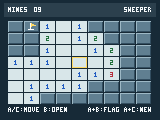

# GitHub Universe 2025 badge toolkit

Restore, configure, and build apps for the colour-screen GitHub Universe 2025
badge with A, B, C, Up, and Down buttons. This fork contains 33 user apps,
MonaOS restoration tools, offline Pokedex downloads, and a paginated launcher.

<p>
  <a href="docs/2025-guide.md">Setup and recovery guide</a> ·
  <a href="docs/apps.md">App catalog</a> ·
  <a href="CONTRIBUTING.md">Contributing</a>
</p>

## What this repository enables

- Restore the official MonaOS v4.03 firmware with a checksum-verified download
  and verified flash writes.
- Back up the entire flash and restore a private snapshot of apps and state.
- Install 33 apps and an auto-discovering, six-page launcher.
- Learn and replay AC remote signals with the [IR remote app](docs/ir-remote.md).
- Compress PNG assets with backed-up originals and [decoder-compatible optimization](docs/asset-optimization.md).
- Configure Wi-Fi and a GitHub profile without committing credentials.
- Download Pokedex sprites for offline browsing.
- Unlock or reset all nine infrared quests.
- Build apps using the desktop simulator, serial REPL, and real-device checks.

This is a deployable app bundle and host-tool collection. The factory firmware
comes from the official release. This repository does not build the custom C
firmware from source or contain a personalized UF2 with private credentials.

## Supported hardware

The target is the GitHub Universe 2025 colour-screen badge, board
`github_badger_2350`, with front A, B, C, Up, and Down buttons. It has an RP2350,
16 MB flash, a 320x240 LCD used at 160x120 logical resolution by these apps,
Wi-Fi, Bluetooth, infrared transmit/receive, and a Qw/ST expansion connector.

**It has no onboard accelerometer or gyroscope.** Motion sensing requires an
external sensor connected through Qw/ST or other expansion wiring. A bundled
sensor driver does not mean that sensor is physically installed.

Mona's Quest uses infrared beacons, not NFC or RFID.

## Start here

**Start with the [restore and tinkering guide](docs/2025-guide.md).**

```sh
git clone --branch universe-2025 https://github.com/anxkhn/github-universe-2025.git
```

Open a terminal in the cloned directory:

```sh
uv run --no-project tools/badge.py doctor
```

Install [uv](https://docs.astral.sh/uv/getting-started/installation/) first.
Backup and flashing also require [picotool](https://github.com/raspberrypi/picotool).
The guide covers installation and the order of backup, flash, deployment,
configuration, and verification.

<details>
<summary>Common commands after installing the tools</summary>

```sh
# Normal serial mode
uv run --no-project tools/badge.py inspect
uv run --no-project tools/badge.py configure
uv run --no-project tools/badge.py sprites
uv run --no-project tools/badge.py quest status

# HOME/BOOT + RESET, then release HOME/BOOT
uv run --no-project tools/badge.py backup .badge-local/before-restore.uf2
uv run --no-project tools/badge.py flash --yes

# Double-tap RESET and wait for BADGER to mount
uv run --no-project tools/badge.py deploy
diskutil eject /Volumes/BADGER
```

Tap RESET after disk ejection. The `flash --yes` command replaces the firmware
and app filesystem. Back up first. The macOS ejection command above has
platform-specific equivalents explained in the guide.

</details>

## Repository layout

| Path | Purpose |
| --- | --- |
| [badge25/](badge25/) | Deployable system files, 33 apps, assets, simulator, and API docs |
| [tools/](tools/) | Verified download, backup, flash, deploy, configuration, quest, and checks |
| [docs/2025-guide.md](docs/2025-guide.md) | Installation, USB modes, recovery, Wi-Fi, and development |
| [docs/apps.md](docs/apps.md) | App catalog, controls, sources, and test results |
| [ir-beacon/](ir-beacon/) | Infrared beacon protocol and hardware experiments |

## USB modes

- Tap RESET once for normal operation and MicroPython serial.
- Double-tap RESET for the `BADGER` app-editing disk.
- Hold rear HOME/BOOT, tap RESET, then release HOME/BOOT for the `RP2350`
  firmware bootloader disk.

The BADGER disk root maps to `/system` on the badge. Put apps in `BADGER/apps/`.
Eject cleanly before resetting. See the guide for verified backup and restore.

## Apps and controls

<p><a href="docs/minesweeper.md"></a></p>

The bundle includes the factory apps, games such as Snake, Gitris, Invaders,
2048, Jungle, Tennis, and Minesweeper, plus Wi-Fi tools, clocks, Hydrate, Tomato, and Pokedex.
See the [catalog](docs/apps.md) for the complete list, sources, and controls.
Minesweeper has [its own controls and development guide](docs/minesweeper.md).
To install one app, use `uv run --no-project tools/badge.py deploy --app minesweeper`.

In the launcher, A/C change icons and pages, Up/Down change rows, B launches,
and rear HOME returns to the menu.

<details>
<summary>What does Copilot Loop do?</summary>

Copilot Loop plays 39 local PNG frames. It targets a 33 ms frame interval,
roughly 30 frames per second, then holds the final frame for 10 seconds before
repeating. Actual playback speed depends on PNG loading and rendering time.

It is a decorative animation. It does not call GitHub Copilot, connect to an AI
model, generate code, or require Wi-Fi. Rear HOME exits to the launcher.
Its implementation is [here](badge25/apps/copilot-loop/__init__.py).

</details>

## Common pitfalls

| Symptom or mistake | What to do |
| --- | --- |
| Badge charges but never appears over USB | Use a data-capable cable and try a direct computer port |
| Confusing BADGER and RP2350 | BADGER edits apps; RP2350 is the firmware bootloader disk |
| Copying to `BADGER/system/apps` | The disk root already maps to `/system`; use `BADGER/apps` |
| Serial copy fails with `OSError: 30` | `/system` is read-only during normal execution; deploy through disk mode |
| Resetting during a copy | Wait for verified deployment, eject cleanly, then reset |
| Serial command disconnects while interrupting an app | Tap RESET, stay at startup or the launcher, and retry with the discovered port |
| Wi-Fi does not connect | Use 2.4 GHz and check the exact password; status -3 reports wrong password |
| Changed disk credentials do not take effect | Update the writable-root `/secrets.py` using `configure` too |
| Contributions show zero or ERR | Hold A+C once to refresh. ERR means no valid data; valid cached totals survive failed refreshes |
| Pokedex has no images | Run `sprites`, then deploy the downloaded PNGs |
| Expecting tilt controls | There is no onboard motion sensor |
| Expecting Copilot Loop to provide AI | It is a local looping animation |

The [guide's troubleshooting section](docs/2025-guide.md#troubleshooting) has
USB diagnostics, NTP recovery, and app-import checks.

## Checks

```sh
uv run --no-project tools/test_badge.py
uv run --no-project tools/test_profile_cache.py
uv run --no-project tools/test_ir_remote.py
uv run --no-project tools/test_minesweeper.py
uv run --no-project --with pillow tools/test_minesweeper_render.py
uv run --no-project tools/check_docs.py
uvx ruff check tools badge25
```

The eleven added apps passed hardware import, initialization, and rendering
checks. The contribution fix fetched and rendered a real profile successfully.
Minesweeper has game-logic and pixel-boundary checks. All 594 runtime PNGs in
the asset-optimization pass decoded on the badge. IR remote passed startup and
storage checks, but learning/replay has not yet worked for the user's AC;
Kenstar compatibility and the transmitter's physical position remain unverified.
These checks do not cover every game level or external API. The physical setup
was tested on an Apple Silicon Mac; Linux and Windows instructions are guidance.

The toolkit targets MonaOS v4.03 for board `github_badger_2350`. Wi-Fi
credentials, downloaded firmware, personal backups, and downloaded Pokemon
sprites stay local. The committed configuration template is empty.

App contributions are welcome. Read [CONTRIBUTING.md](CONTRIBUTING.md) and
[AGENTS.md](AGENTS.md). The source license is [MIT](LICENSE); imported app
attribution and asset sources are recorded in the catalog.
