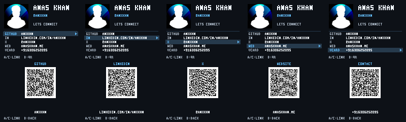

# Social card

## Contact vCard

The fifth link is **Contact**. Press B to display a vCard 3.0 contact QR with
Anas Khan, mobile `+916306252095`, `anaskhan.me`, GitHub, LinkedIn, and X.
Download [anas-khan.vcf](anas-khan.vcf) to import the same contact directly.
Social links use standard repeated `URL` fields. Contact apps may display
them without labels. Name and phone remain standard vCard fields.

Every QR now uses version 9, a 53x53 data grid, a four-module quiet zone, and
one logical pixel per module. Every white square is 61x61 logical pixels at the
same position. The shorter URL payloads therefore have exactly the same grid
density as the contact QR. On the physical pixel-doubled display each logical
module occupies 2x2 physical pixels. The longer vCard cannot fit at the previous
two-logical-pixel scale within the screen height. Physical camera scanning of
this format remains unverified; use the downloadable VCF if needed.
Error correction is L rather than M, reducing redundancy. The data grid has
41% fewer modules than the previous version 13. All five codes retain the same
grid and module size.

There are ten profile/QR screens.

All four profile views and their four QR views passed real-device loading and
rendering on the installed MonaOS badge. Physical camera scanning still needs
a test. Repeat rendering with
`uvx --from mpremote==1.29.0 mpremote run tools/check_social_card_device.py`.

An offline name badge for Anas Khan on the Universe 2025 MonaOS firmware.
The portrait, four links, and contact phone stay visible on a 160x120 profile screen.
The selected row has a filled background and an arrow, so selection does not
depend on color alone. Lettering uses the repository's original 3x5 bitmap
alphabet, with the name at 2x size. The display doubles these logical pixels
to its physical 320x240 resolution. Link lettering appears in uppercase.



## Controls

| Button | Action |
| --- | --- |
| A or Up | Previous link, wrapping |
| C or Down | Next link, wrapping |
| B | Toggle the selected link's QR screen |
| HOME | Return to the launcher through MonaOS |

Link selection also works while a QR screen is open. Opposite directions
pressed together cancel. Two buttons for the same direction advance once.
Opening the app resets it to GitHub with the QR screen closed.

## Public profile and asset provenance

| Field | Value |
| --- | --- |
| Name | Anas Khan |
| GitHub | https://github.com/anxkhn |
| LinkedIn | https://linkedin.com/in/anxkhn |
| X | https://x.com/anxkhn |
| Website | https://anaskhan.me |
| Avatar | https://avatars.githubusercontent.com/u/83116240?v=4 |

Verified on October 4, 2026. The [portfolio](https://anaskhan.me) publishes
the exact LinkedIn, GitHub and X links. The public
[GitHub social accounts API](https://api.github.com/users/anxkhn/social_accounts)
independently publishes `https://linkedin.com/in/anxkhn`. The
[GitHub profile API](https://api.github.com/users/anxkhn) supplies the name
and avatar URL. The LinkedIn slug was read from those explicit links.
The app displays no follower or contribution statistics.

`assets/avatar.png` is the original downloaded public user avatar, included
at the user's request. Its SHA-256 is
`ae2ce9e6bc767404b7a4128667a8596135e2709ccfd9e24e9d78a13921847055`.
The photo remains the owner's image. It is not claimed as original artwork
or relicensed as third-party code. Rebuilds crop and resize it to 48x48.

The screen layouts and 24x24 identity-card launcher icon are original artwork
generated by `tools/build_social_card.py`. Bitmap lettering reuses
`GLYPHS` from this repository's `tools/build_minesweeper_assets.py`, with
original period and at-sign additions. No external font or copied logo is
bundled. Generated PNGs carry `Source` metadata, and profile screens also
record the avatar URL. QR PNGs record the URL and module geometry.
`assets/manifest.json` records profile identity, source hash, screen dimensions,
text bounds and QR bounds. The app's `LINKS` tuple is the build source of truth.

## Offline rebuild and checks

Run from `home/`. The source photo is bundled, so the normal rebuild makes
no network requests. Dependencies are pinned for byte-identical PNG output.

```sh
uv run --no-project --with pillow==12.1.0 --with qrcode==8.2 tools/build_social_card.py
uv run --no-project --with pillow==12.1.0 --with qrcode==8.2 tools/test_social_card.py
uv run --no-project --with ruff ruff check badge25/apps/social-card/__init__.py tools/build_social_card.py tools/test_social_card.py
```

To re-fetch the original verified photo explicitly:

```sh
uv run --no-project --with pillow==12.1.0 --with qrcode==8.2 tools/build_social_card.py --fetch-avatar
```

The builder refuses a downloaded photo with a different hash. Review a changed
avatar before deliberately updating the pin and provenance. It saves ten
full-screen RGB PNGs, the icon, manifest and previews under
`docs/images/social-card*.png`. The source photo's bytes stay unchanged.

Tests check exact URL consistency, source hash, PNG dimensions and metadata,
text and QR bounds, every module against the QR matrix, and a
four-module white quiet zone. They render all ten runtime states through a
host Badgeware stub, exercise wrapping, toggle behavior and simultaneous
buttons, check import and cleanup behavior, and rebuild in a temporary tree
without network access to compare every output byte-for-byte.

## Runtime and QR geometry

The app imports without starting a loop or loading an image. `init()`,
`update()` and `on_exit()` follow the MonaOS launcher lifecycle. A standalone
`run(update)` call is guarded by `if __name__ == "__main__"`.

The app decodes changed PNGs directly into the existing screen buffer with
`screen.load_into`. It does not allocate a second 75 KiB full-screen image.
This fixes the reported `MemoryError` at the old `Image.load` line. A hardware
check switched views 100 times without error; free Python heap stayed about
213 KiB. The screen persists between updates, and unchanged views need no
decode or copy. No runtime Wi-Fi, QR generation, or font load is needed.

QRs encode the exact HTTPS URLs or the contact vCard with error correction L.
All use the same version and module geometry described above. The builder
places them unchanged and refuses overflow; QR imagery never passes through
a resize filter. Host checks verify geometry,
not camera scanning on the physical display. Physical scan testing remains
necessary before relying on it at an event.

To preview interactively on the host:

```sh
uv run --no-project --with pygame badge25/simulator/badge_simulator.py badge25/apps/social-card
```

The deterministic preview PNGs contain exactly the deployed screen pixels.
Simulator F12 capture is available with `--screenshots DIR`; it does not
require an `Image.save` method on the badge.

## Installation contents

The app directory is `badge25/apps/social-card/`. Copy its `__init__.py`,
`icon.png` and `assets/` directory together to `/system/apps/social-card/`.
In BADGER disk mode, the volume root maps to `/system`, so the destination
is `BADGER/apps/social-card/`. The bundled avatar and manifest are build
inputs and provenance; the runtime only reads `card-0.png` through
`card-3.png` and `qr-0.png` through `qr-3.png`.

Launcher catalog integration is separate. This change does not install or
exercise the app on hardware.

## Library references

- [Pillow ImageOps.fit](https://pillow.readthedocs.io/en/stable/reference/ImageOps.html#PIL.ImageOps.fit)
- [Pillow PNG metadata](https://pillow.readthedocs.io/en/stable/PIL.html#PIL.PngImagePlugin.PngInfo)
- [python-qrcode usage and quiet zone](https://github.com/lincolnloop/python-qrcode#advanced-usage)
